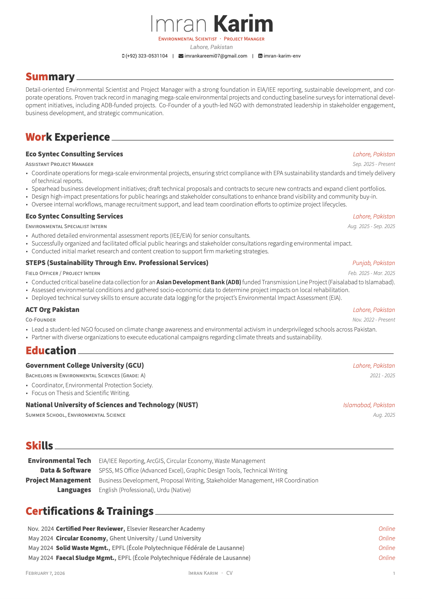

<h1 align="center">
  <br />
  High Leads Awesome CV - 2026
</h1>

<p align="center">
  LaTeX template for your outstanding job application
</p>

<br />

## What is Awesome CV?

**High Leads Awesome CV - 2026** is LaTeX template for a **CV(Curriculum Vitae)**, **Résumé** or **Cover Letter** It is easy to customize your own template, especially since it is really written by a clean, semantic markup.


## Preview



##PDF
![Preview pdf] (pdf/Imran_Karim_CV.pdf)


## Quick Start

* [**Edit Résumé on OverLeaf.com**](https://www.overleaf.com/latex/templates/awesome-cv/tvmzpvdjfqxp)
* [**Edit Cover Letter on OverLeaf.com**](https://www.overleaf.com/latex/templates/awesome-cv-cover-letter/pfzzjspkthbk)


## How to Use

#### Requirements

A full TeX distribution is assumed.  [Various distributions for different operating systems (Windows, Mac, \*nix) are available](http://tex.stackexchange.com/q/55437) but TeX Live is recommended.
You can [install TeX from upstream](http://tex.stackexchange.com/q/1092) (recommended; most up-to-date) or use `sudo apt-get install texlive-full` if you really want that.  (It's generally a few years behind.)

#### Usage

At a command prompt, run

```bash
$ xelatex {your-cv}.tex
```

This should result in the creation of ``{your-cv}.pdf``


## Credit

[**LaTeX**](http://www.latex-project.org) is a fantastic typesetting program that a lot of people use these days, especially the math and computer science people in academia.

[**LaTeX FontAwesome**](https://github.com/furl/latex-fontawesome) is bindings for FontAwesome icons to be used in XeLaTeX.

[**Roboto**](https://github.com/google/roboto) is the default font on Android and ChromeOS, and the recommended font for Google’s visual language, Material Design.

[**Source Sans Pro**](https://github.com/adobe-fonts/source-sans-pro) is a set of OpenType fonts that have been designed to work well in user interface (UI) environments.


## See Also

* [Medical Guardian - False Alarm Detection System](https://github.com/Salman-Pixel/medical-guardian-ml) - Production-grade ML system to reduce false alarm dispatches by 40% while maintaining 95%+ recall on real emergencies.